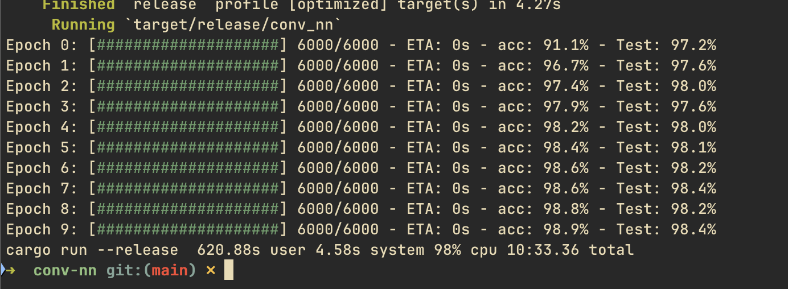

# conv-nn

A basic Convolutional Neural Network in Rust from scratch

## Overview

This is a basic implementation of a Convolutional Neural Network (CNN) in Rust specifically for the [MNIST dataset](https://yann.lecun.com/exdb/mnist/). For one of my grad classes, we had to implement a CNN from scratch in Python, which was a fun exercise but incredibly slow. I thought it would be a fun challenge to implement one in Rust. The goal of this project is to not abstract away any of the underlying math and concepts with libraries where reasonable. While it's not optimized at this point in time, I plan to implement some optimizations in the future.

## Demo

## TODO

- [ ] Implement a quick `wget` script to grab dataset
- [ ] Put together benchmarking for implementation
- [ ] Would be interesting to see if we can generate a `.bin` and use for inference in a notebook or other demo
- [ ] Work on some of these optimizations (rayon for parallelization, etc.)
- [ ] Full write up of the math and concepts behind CNNs (and maybe some other stuff)
- [ ] Showcase full accuracy of the network
